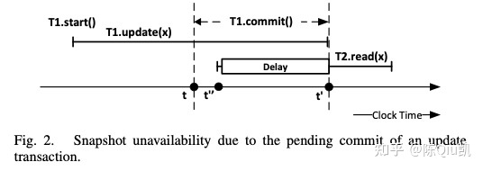

# 前言

在日常生活中，时间是有意义的，各大洲按照时区划分，区域内的一切按照时间顺序运行。比如某月某日某时某分发生什么事件，事件因为时间的先后顺序的不同而变得意义非凡。例如某时某分的某事件发生，导致了某时某分另一起事件的发生，我们称之为事件间的关联性，或者叫事件间的有序性。

从分布式系统上看，如何保证在分布式环境下的各个节点间的事件有序性是一个让人头疼的问题。分布式系统的问题根源在于其会带来的信息交互上的延迟、丢失、乱序等一系列问题，而这些问题则会进一步影响了事件和事件间的有序性，比如导致事件错乱等。

《Time, Clocks, and the Ordering of Events in a Distributed System》这篇论文的核心即是聚焦在讨论事件序列上，事件序列指的是特定环境中的事件发生的先后顺序。而时间只不过是事件序列的一种定义方法而已。


# 分布式环境的有序性技术

下面我们展开讲讲分布式系统中的一些有序性保证的技术和基本原理，这些技术在分布式领域，比如分布式数据库、分布式KV存储系统中都有着广泛应用，需要系统以此实现了RR或是SI的隔离级别。

## 全局授时TSO

最简单也最容易想到的分布式环境有序性保证技术即使统一的全局授时，即由一个中心节点来提供统一递增的时序，分布式集群的其他节点都从中心节点处获取时序再进行相应操作。业界像Google的Percolator、PingCAP的TiKV就是这么做的。

TSO的优点十分明显，架构简单并且经过并发优化（如pipeline等）可以达到百万的tps，对单个集群来说，百万级别的事务操作吞吐量已经足够了。但缺点也很明显，TSO不可避免的多了至少一个rtt的开销（Percolator事务机制需要多2次rtt开销），此外TSO还需要解决节点高可用的问题（如结合Paxos或者Raft进行高可用切换）。

总体来说，全局授时TSO是一种实现成本极低同时又具备生产可用的有序性技术。


## 混合逻辑时钟HLC

Hybrid logical clock混合逻辑时钟，其设计机制为逻辑时钟的进阶版，本质也是实现了**去中心化且满足外部一致性**的全序时钟系统。

HLC同时考虑了物理时钟wall time和逻辑时钟logical time，wall time是该节点已知的当前系统中的最大物理时间，logic time用于比较wall time相同的事件之间的先后顺序。HLC所依赖的物理时间需要集群间以NTP时钟同步协议方式运行，以保证各节点间的UTC时间差不会过大。

简单来说，HLC的机制在于节点发送消息时会将本地物理时间和逻辑时间同时传递过去，接收方会比较本地的物理时钟和逻辑时钟与消息传递体中传递过来的物理时间和逻辑时间，取其最大值并更新到本地，随着节点间通信的进行不断推高本地已知的物理时间和逻辑时间。

#### 发送方

```
// get current wall and logic
oldWall = wall;
wall = max(oldWall, now());
if (wall == oldWall) { 
    // oldWall > now(), then increase the logic increment
    logic = logic + 1;
} else {
    // oldWall <= now(), then set logic into zero
    logic = 0;
}

// send msg with wall and logic
send msg{content: XX, wall: wall, logic: logic}
```

#### 接收方

```
// compare wall time first
oldWall = wall;
wall = max(wall, recvEvt.wall, now());
if (wall == oldWall && wall == recvEvt.wall) {
    // oldWall == recvEvt.wall > now(), then compare and get the max logic
    logic = max(logic, recvEvt.logic) + 1;
} else if (wall == oldWall) {
    // oldWall > recvEvt.wall && oldWall > now(), then increae the local logic directly
    logic = logic + 1;
} else if (wall == recvEvt.wall) {
    // recvEvt.wall > oldWall && recvEvt.wall > now(), then increase the sended logic directly
    logic = recvEvt.logic + 1;
} else {
    // now() > oldWall && now > recvEvt.wall, then set logic into zero
    logic = 0;
}
```

总体而言，HLC结合了"纯粹的逻辑时钟"和"不可靠的本地时钟"，兼顾两者准确性的同时实现了去中心化，在消息通信传递中进行混合时钟的比较和同步，以此达到类似”全序“的效果。业界如CockroachDB等就实现了基于HLC的分布式事务。


## 时钟快照隔离Clock-SI

Clock-SI出自EPFL 2013年发表的论文，它实现了完全的去中心化并且只依赖本地时钟。虽然Clock-SI和HLC一样，都依赖于NTP的时钟同步协议来保证delay是有界的，但Clock-SI最精妙的地方在于，时钟同步的延时只会影响性能而不会影响正确性。

Clock-SI提出了快照级别隔离的设计机制：

- 基于快照读取具备**一致性**，每个事务都会分配一个快照时间戳，由`snapshotTS`标识，这里**一致性**的含义为：快照可以看到包含`snapshotTS`前的所有写入数据但无法看到不包含`snapshotTS`之后的所有写入数据；
- 以**全序**来提交事务，每次事务提交都会产出一个新快照，由`commitTS`标识；
- 两个并行事务不允许writeset存在交集，且`[snapshotTS,commitTS]`也不允许有重叠；

### 原理浅析

我们举些例子来看看如何理解Clock-SI的设计机制

#### 例1：时间差延迟读取


假设事务T依赖的数据散落在两个partition(P1/P2)，且P1和P2存在时间差，比如P2的本地时钟落后θ个单位。当从P1发起事务T时，被赋予了`snapshotTS=t`，事件到达P2的时间为`t'`，因为时间差的原因，此时`t' < t`，在P2这个partition上还没有满足T事务的commit快照，若在`(t',t)`区间内有其他的事务在P2上执行了commit，那应该被T可见。因此这里会将事务T的读取delay直到now >= t再执行读取，此时在`(t',t)`区间内的任务提交事务都会被读取到。

#### 例2：事务提交期间延迟读取



当同一个partition（P）上有多个并行的事务(T1/T2)时，T1在`t`时刻发起commit，被赋予`commitTS=t`，但commit本身需要一定的时间完成数据的持久化（即T1处于pending-commit状态），所有操作会在`t'`时刻完成。如果在`(t,t')`区间内发起了事务T2，假设`snapshotTS=t'' ` 并且 t <t''< t'，那么T2的读数据请求同样需要delay直到now > `t'`后才能执行读取，保证快照读取的一致性。

### 具体算法实现

#### Clock-SI Read

- **StartTS**：发起一个事务T，由第一个partition（*originating partions*）的本地时钟赋予`T.snapshotTS`；

- **ReadData**：处理读请求：

- - 1) 若数据是事务T writeset的一部分，直接返回；
  - 2) 若数据被另一个事务T'更新了且T'处于committing状态且`T.snapshotTS>T'.commitTS`，则delay直到T'的commit请求完全完成（*消除pending-commit的影响，满足正确性的第一条*）；
  - 3) 若数据被另一个事务T'更新了且T'处于prepared状态且`T.snapshotTS>T'.prepareTS`且`T.snapshotTS>T'.commitTS`，同样delay直到T' commit完成（*T'已完成2PC中第一阶段，T'不可逆了*）；
  - 4) 若到达partition Px时，`T.snapshotTS > Px.now()`，delay直到`T.snapshotTS < Px.now()`（*消除时间差的影响*）；

#### Clock-SI Commit

事务commit涉及写数据，维护快照一致性更复杂一些，需要区分单partition和多partition的情况。

- **Certificate**：检查当前writeset与并行事务的writeset是否有交集，在commit前做校验；
- **LocalCommit**：检查通过即直接commit；
- **DistributedCommit**：分布式跨partitions的场景下，借鉴了2PC的做法。

将第一个发起事务的partition（originating partition）作为coordinator：

1. 向所有参与事务的partition发起`prepare`请求，直到收到`prepared`响应，T的状态进入`committing`；
2. 设`T.commitTS=max(Px.prepareTS | {P1,P2..Px})`，即取所有分区prepareTS的最大值作为commitTS，执行commit完成，并将状态置为`committed`（正确性的关键）；
3.  向所有partition发送`commit`请求；

对于其他partition： 

1. **prepare**：执行certificate，通过后状态置为`prepared`并获得`prepareTS=now()`，携带`prepareTS`向coordinator返回`prepared`响应； 
2. **commit**：状态置为`committed`后结束；

前面说过，虽然Clock-SI和HLC一样，都依赖于NTP的时钟同步协议来保证delay是有界的，但是Clock-SI最精妙的地方在于，**时钟同步的延时只会影响性能而不会影响正确性**。简单分析下正确性是如何保证的：

1. writeset不冲突：每次commit前做检查；
2. 全序提交：单机时由本地时钟保证，分布式时由2PC和commitTS的max赋值规则保证，
3. 读快照一致性：因commit是全序的，事务可见的快照顺序也具备全序，通过读协议中delay机制保证不会错过任何一个`commitTS<snapshotTS`的事务；

在实际实现中，我们可以将`snapshotTS`提前，以换取更小的冲突概率和更短delay时长，以提升事务的在线可用性，但同时事务可能会读到更老的快照，这是工程实现的tradeoff。


## Spanner True Time

Google氪金技术的典范，利用GPS和原子钟实现了高精度的，满足外部一致性的授时服务，其本质是在通过GPS和原子钟实现高精度的时钟同步基础上，加入commit wait的等待时间来达到”全序“的效果，以此满足分布式系统的可见性/隔离性需求。目前技术没有开源，因此业界也没有其他公司实现类似的技术。期待后续能将具体实现技术开源出来。


