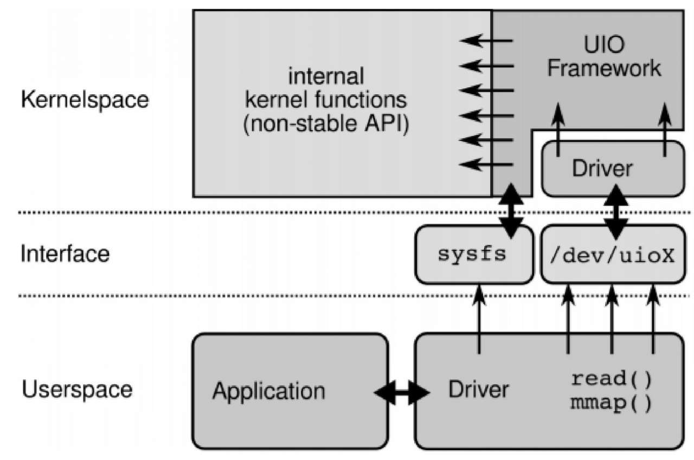
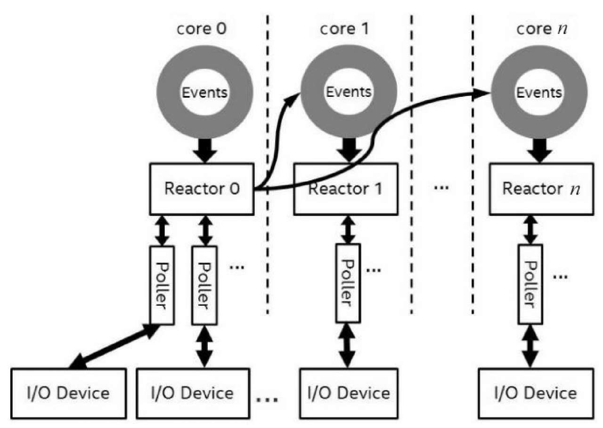

# 背景

随着新兴硬件的发展，固态设备比如PCIe®4.0 PM9A3 NVMe SSD的随机读性能已经达到百万IOPS以上。如今面临的一个主要挑战是：因为固态设备吞吐量和延迟性能比传统的磁盘好太多，现在总的IO处理时间中，存储软件（比如内核态IO栈）占用了很大的比例。换句话说，存储软件栈的性能和效率在整个存储系统中越来越重要，随着存储设备的继续发展，存储设备将会受制于相关软件的不足而不能发挥全部性能。

## NVMe SSD

在NVMe之前，相对来说存在时间更长的接口标准是串行ATA高级主机控制器接口（Serial ATA Advanced Host Controller Interface,AHCI）。AHCI允许存储驱动程序启用高级串行ATA功能，相比传统的IDE技术，AHCI改善了传统硬盘的性能。但是随着新介质、新技术的发展，AHCI对新兴固态设备来说逐渐成为性能瓶颈，这个时候NVMe顺势而生。

现在的多层工艺3D NAND技术可以SSD在容量和访问速度上远超普通的SSD固态硬盘，而NVMe（Non-Volatile Mmeory Host Controller Interface Specification）非易失性存储主机控制器接口标准则是能让3D NAND SSD发挥出最好性能的协议接口。NVMe使用PCIe总线来提供更大的带宽和更低的延迟连接，同时实现了数据解析传输的并行方式，当数据从存储设备传输到主机时会进入队列中，普通的SATA设备只能支持一个队列，而NVMe则支持最多65536个队列，每个对列有65536个条目，这极大地提高了吞吐量。

 

NVMe协议在设计时采用了环型结构，通过提交队列和完成队列作为请求和响应。对NVMe SSD设备的完成队列结果轮询是非常快速的，按照NVMe规范，只需要读取内存中的相应内容来检测队列是否有新的操作完成。而英特尔的DDIO技术可以保证设备在更新以后，相应的内容是在CPU的缓存中的，以此实现高性能的设备访问。


### 内核NVMe驱动

NVMe设备通过probe注册驱动后，会为每个CPU创建独立的IO队列，每个IO队列包含一组提交请求和完成结果的环形队列。

#### 中断模式

当启用中断处理模式时，会为每个CPU队列申请独立的中断向量irqs，CPU之间互不干扰，数据提交和响应收割不需要加锁，保证性能最优。中断触发时执行中断函数向完成结果队列进行IO响应结果的收割，执行响应结果bio回调函数完成IO请求。

#### 轮训模式

在旋转设备时代（磁带和机械硬盘），中断开销只占整个I/O时间的一个很小的百分比，因此给系统带来了巨大的效率提升。然而，在NVMe固态设备的时代，中断开销成为了整个I/O时间中不能被忽视的部分。这个问题在更低延迟的设备上只会越来越严重。 


​															图示：IO设备产生中断（IRQ）异步事件，设备驱动IRQ handler执行完成事件 													

在此背景下，也催生了相应支持轮训模式的设备驱动。当启用Polled轮训模式时，通过在提交完请求后发起nvme_poll操作来主动发起轮训操作，收割IO响应结果，以此来优化降低IO时延。

内核态驱动支持普通轮训和混合轮训两种模式：

- 普通轮训在发起IO请求后立即发起轮训操作收割IO响应结果，该方式可最大限度降低IO时延，但相应也会增加CPU开销（即存在无效轮训的情况）。
- 混合轮训模式支持自适应和固定时间轮训，即在自适应时间或者固定时间以后发起IO轮训，以此减少无效CPU的开销。对于自适应模式，轮询延迟（睡眠时间）设置为通过经典轮询获得的平均设备命令服务时间的一半（通过收集命令统计信息后启动）。


# 高性能存储IO技术

本章我们详细剖析下传统的软件技术栈对于NVMe SSD的性能影响，同时介绍当下高性能存储IO的几种技术实现。

## 同步IO

同步IO通过标准的Posix接口可以提供同步IO读写的支持，如open/write/read/pread/pwrite等常见的IO操作接口均为同步IO方式。


1. 应用通过共享库或Syscall指令执行系统调用，进行上下文切换（栈切换、指令寄存器现场保存等）进入内核态，执行系统调用逻辑。
2. 执行系统调用write/read逻辑，进入VFS虚拟文件系统层。非direct IO场景，存储设备的读写都经过page cache进行redix tree的页读写，写入的页称为脏页，fsync或sync命令可将脏页持久到下层，内核flush线程也会定期将page cache中的脏页持久化到块设备层。
3. 而 direct IO场景会绕过page cache调用下层文件系统进行读写操作，特殊地，对于块设备句柄的 Direct IO会直接向通用IO层发起读写请求。
4. 对于文件的offset+length读写，会经过文件系统层的转换函数进行转换，得到具体要读写的扇区，扇区读写请求落到通用块层后，会根据不同扇区构造成bio块设备请求，连续的扇区将被构造成同一个bio块设备请求，非连续的扇区将被构造成不同的bio请求。对于内存组织而言，DMA支持将连续的扇区数据映射传输到连续的内存页上，也支持将连续的内存页映射传输到连续的扇区上，但不支持非连续的内存页的读写，虽然在某些架构io_mmu下可以同时对多个扇区进行DMA的数据读取，但大部分情况下是不支持的。
5. 通用块层主要是执行扇区到bio的转换，之后根据注册的驱动情况进行判断，对于NVMe等块设备驱动来说，是不需要进入IO调度层和scsi层的，bio请求会直接进入相应的驱动层进行数据读写。
6. 对于SAS类型接口设备而言，通用块层的bio请求会先进入IO调度层进行调度，此处会根据不同的调度策略（Noop/CFQ/Deadline）采取不同的调度算法进行bio请求的合并和重排序，之后通过将bio任务写入任务队列后即可返回（read/write系统调用到此处就返回了，之后进入等待），之后由其他线程执行request queue的处理操作，将任务队列下发到驱动层进行处理。 


**我们以Ext4为例，剖析下Read系统调用的完整IO调用栈** ：

 

- 在上述流程中，用户态线程通过系统调用切换上下文陷入内核态，初始化iov_iter和kiocb两种数据结构，即将kiocb描述的文件数据，读取到iov_iter描述的内存中。
- 接着执行具体文件系统的页读取函数，对于bufferIO，需要申请相应的文件页缓存，并且在涉及页操作过程需要加解锁保证互斥，同时还有文件系统页访问偏移到块设备bio的转换。
- 在执行完块设备submit bio提交操作后，当前线程还会加入页Page的等待队列中等待块设备执行完成后唤醒。
- 提交的bio请求会被初始化成bio request并执行相应的蓄流和调度算法合并流程，最终通过具体设备驱动挂载的提交函数queue_rq将请求提交到具体块设备控制器中。
- IO请求执行完成后，由设备控制器发起中断，CPU陷入中断上下文执行中断向量函数，收割IO请求结果并执行相应的bio回调函数，同步唤醒页上的等待队列成员，接着用户线程进行数据的内存拷贝（对于buffer IO场景需要进行两次的数据内存拷贝），最后进行系统调用的上下文切换回到用户态继续执行。 

可以看到，**传统的同步IO模式下，除了系统调用上下文切换、文件系统、块IO栈的开销以外，还有中断上下文切换以及内存拷贝等开销。** 这些开销直接导致了同步IO场景下的性能瓶颈。


## 异步IO

虽然在Linux系统中提供了丰富的IO操作语义，如read/write/pread/pwrite/preadv/pwritev等等，但这些语义都属于同步IO操作，即系统调用只会在数据就绪时才返回，在此期间，用户态线程会被阻塞等待。这种方式使得程序无法达到最佳的性能，本章我们将介绍Linux系统下的异步IO技术及相应原理。

### AIO

AIO技术是Linux 2.6版本最初支持的原生异步IO接口，有一个限制是必须与directIO一同使用才能有异步的效果。

以下是最主要的三个系统调用：

```
// 创建一个异步IO上下文
int io_setup(int maxevents, io_context_t *ctxp); 
// 提交IO请求
int io_submit(io_context_t ctx, long nr, struct iocb *ios[]);
// 获取完成的IO响应
int io_getevents(io_context_t ctx_id, long min_nr, long nr, struct io_event *events, struct timespec *timeout);
```


#### 初始化

在io_setup()系统调用中完成，主要工作是初始化kioctx结构，在aio_setup_ring()函数中创建虚拟文件，进行内存映射，初始化ring buffer。

```
struct kioctx {
    struct percpu_refusers;
    atomic_tdead;

    struct percpu_refreqs;

    unsigned longuser_id;     // io_setup()中返回给应用的io_context_t *ctxp，同时等于mmap_base
    ...
    unsignedmax_reqs;    // io_setup()中的nr_events
    unsignednr_events;    // ringbuffer数量，根据nr_events计算

    unsigned longmmap_base;    // aio ring buffer 内存起始地址
    unsigned longmmap_size;    // aio ring buffer 内存大小

    struct page**ring_pages;    // aio ring buffer 对应的内存页
    longnr_pages;        // aio ring buffer 内存页数量
    ...
    struct file*aio_ring_file;    // aio ring buffer 内存映射的文件

    unsignedid;
}
```

kioctx 代表一个aio上下文，描述aio的全部信息，在io_setup()系统调用中生成，与应用层的aio_context_t对应。其中最重要的是通过mmap_base，mmap_size,ring_pages,nr_pages 等数据描述一段内存，用于以ringbuffer的形式存放aio请求结果io_event。

应用在初始化kioctx 时创建一个虚拟文件，通过mmap映射该文件得到一块共享内存，这样就可以直接访问该段内存来查看io完成状态。

#### 提交IO请求

```
struct iocb {
    void *data;
    short aio_lio_opcode;
    int aio_fildes;

    union {
        struct {
            void *buf;
            unsigned long nbytes;
            long long offset;
        } c;
    } u;
};
```

io_submit()系统调用进行IO请求的提交，以读操作为例，主要调用栈为：io_submit()->io_submit_one()->__io_submit_one()->aio_read()->call_read_iter()。

aio_read()函数将应用层传入的iocb结构转换为具体的io操作，大致流程如下：

1. 调用aio_prep_rw()，设置kiocb结构的参数，最重要的是设置了kiocb->ki_complete回调为aio_complete_rw()，例如直接directIO读写块设备文件时的blkdev_direct_IO()函数中，是根据kiocb->ki_complete非空来判定本次io是否为异步。
2. 调用aio_setup_rw()，将iocb中传入的aio_buf，aio_nbytes数据转换为iov_iter结构。
3. 调用rw_verify_area()，校验是否可读。
4. 调用call_read_iter()，读取文件数据。结合对generic_file_read_iter() 以及directIO的分析，只有当使用directIO时call_read_iter()才会立即返回-EIOCBQUEUED，否则仍然会阻塞至io完成。

#### IO请求完成

IO处理完成时触发kiocb->ki_complete的函数回调，即执行aio_complete_rw()，在其中调用aio_complete()函数将结果按io_event结构存入ringbuffer，并更新aio_ring。若有在阻塞等待结果的线程，则将其唤醒。若跟epoll一起使用而配置了eventfd，则发信号通知epoll线程有事件可处理。

#### 应用等待IO完成

应用层通过io_getevents()系统调用获取io请求结果，可由参数配置是否需要阻塞，结果以io_event结构放回给应用层。其调用栈为：io_getevents()->do_io_getevents()->read_events()->aio_read_events()->aio_read_events_ring()，最终在aio_read_events_ring()中将ringbuffer中的io_event数据拷贝给应用层，并更新aio_ring。

总的来说aio技术主要是利用了block层的IO完成回调机制来实现异步，aio在Linux2.6中就已经支持了，但并未得到广泛的使用，其中主要有以下几个原因：

- 其一为aio技术与directIO的耦合太深，当用户想使用异步IO时必须要使用directIO，就不得不放弃pagecache的优化效果，并且必须处理IO的大小偏移使其对齐blocksize，也使得应用起来并不方便。而如果要使用带缓存的方式，则接口的工作方式与同步的相同。
- 其二对于一些存储设备，仅有固定个数的请求槽(request slot)。如果某个时刻这些request slot都正在使用，那么IO的提交过程需要阻塞等待，而该阻塞具有不确定性。
- 其三在IO操作的过程包括提交请求与等待完成两个步骤。该接口的每个IO的提交需要复制64 + 8 个字节，并且在完成时需要复制32 字节的数据。对于完整的单个IO操作总共需要复制104个字节，这种额外的复制操作也会使得IO操作变得缓慢。

社区内一直对aio的很多设计不够满意，**直到全新的异步io接口iouring的出现，它提供了一套全新的异步IO交互方式，用于解决aio使用上的问题，以及更好的发挥异步IO性能**。


### IOURING 

前面提到Linux的aio接口会在IO过程中涉及到比较多的复制操作。为了进一步提高IO性能，我们需要避免复制操作，这就要求内核与应用不需要共享IO过程中的数据结构，同时还要管理两者之间的同步。Linux在5.1版本支持全新的异步IO技术IOURING，由Block IO的作者Jens Axboe开发，其本意是提供一套公用的网络和磁盘异步IO，不过IOURING目前在磁盘方面要比网络方面更加成熟。


IOURING总体设计上通过一对单生产者单消费者的环形缓冲区，分别是提交队列(submission queue, SQ)与 完成队列(completion queue,CQ)来实现用户态与内核态的异步IO协作。采用这种方式，整个异步IO的操作包含两个部分，分别是IO请求的提交以及对应的结束事件处理。对于IO操作请求提交步骤，应用程序是生产者而内核是消费者，而对于IO操作的结束事件则与之相反。

以下是主要的几个系统调用：

```
// 初始化io_uring
int io_uring_setup(unsigned entries, struct io_uring_params *params);
// 用户态应用提交IO请求后通知内核需要进行IO处理
int io_uring_enter(unsigned int fd, unsigned int to_submit, unsigned int min_complete, unsigned int flags, sigset_t sig);
// 用于支持优化文件fd引用计数、页缓存区映射优化等特性
int io_uring_register(unsigned int fd, unsigned int opcode, void *arg, unsigned int nr_args);
```

#### 初始化

io_uring_setup函数返回一个io_uring的fd，后续通过这个fd来操作io_uring。entries是创建出的io_uring中包含的sqe（请求）数量，必须是1-4096间的2的幂级数。io_uring_params是一个与内核的交互参数，用户态调用者在其中指定需要的参数，内核也在其中反馈实际创建的情况，其定义和解释如下：

```
struct io_uring_params {
    __u32 sq_entries;   				// sq请求队列的长度，由内核设置
    __u32 cq_entries;   				// cq完成对列的长度，由内核设置
    __u32 flags;       		 			// io_uring运行模式和配置，由应用设置
    __u32 sq_thread_cpu;  				// 为内核侧轮询线程设置具体的CPU
    __u32 sq_thread_idle;  				// 内核侧轮询最大空闲时间，超过空闲时间，内核线程将会休眠，等待WAKEUP唤醒
    __u32 resv[5];   					// 预留字段
    struct io_sqring_offsets sq_off;  	// sq队列各个成员变量的offset，用于初始化时生成应用端的sq队列结构体信息
    struct io_cqring_offsets cq_off;  	// 同上，只不过是cq队列的
}
```

当初始化完成之后，用户态应用需要通过mmap映射将SQ Ring和CQ Ring映射到自身虚拟内存地址空间上，这样就可以直接和内核共享同一片Ring Buffer内存，数据不再需要经过系统调用进行拷贝。

预定义的mmap映射时的起始位置如下：

```
#define IORING_OFF_SQ_RING        0ULL
#define IORING_OFF_CQ_RING        0x8000000ULL
#define IORING_OFF_SQES           0x10000000UL
```

#### IO提交

如上提到的，用户态通过mmap映射将SQ Ring和CQ Ring映射到自身虚拟内存地址空间上以后，就可以直接进行IO请求的提交操作了：

```
sqe = io_uring_get_seq(&ring);
io_uring_prep_read(sqe, fd, buffer, 4096, offset);
```

IO提交请求项sqe详细结构如下：

```
struct io_uring_sqe {
    __u8 opcode; 	// io请求的操作类型，比如IORING_OP_READV
    ——u8 flags;
    __u16 ioprio; 	// 优先级，和ioprio_set系统调用的作用类似
    __s32 fd;  		// 需要操作的文件fd
    __u64 off;  	// 文件偏移位置
    __u64 addr; 	// 读写数据地址，如果时readv/writev请求则是iovec数组地址。如果是普通read/write则是对应的数据内存读写地址
    __u32 len; 		// 读写数据长度，如果时readv/writev请求则是iovec数组长度。如果是普通read/write则是对应要读写的数据长度
    union { 		// 跟特定op-code相关的一些flag，比如IORING_OP_READV操作，那么这些flag跟preadv2系统调用是一一对应的
        __kernel_rwf_t    rw_flags; 
        __u32        fsync_flags; 
        __u16        poll_events; 
        __u32        sync_range_flags; 
        __u32        msg_flags;
    };
    __u64 user_data; // 用户数据标记，跟cqe中的user_data对应
    union {
        __u16 buf_index; // 预留字段
        __u64 __pad2[3]; // 对齐
    };
}
```

当应用端提交了IO请求了，同样地也需要告知内核需要进行处理，为此需要执行io_uring_enter系统调用。当然，实际执行过程中在执行一定IO队列深度的设备上，我们可以批量提交IO请求之后再进行io_uring_enter系统调用，依此提高系统的整体吞吐。

```
int io_uring_enter(unsigned int fd, unsigned int to_submit, unsigned int min_complete, unsigned int flags, sigset_t sig);
```

- fd为需要执行IO操作的文件fd
- to_submit告诉内核当前SQ ring有多少个待处理请求
- flags标记位目前有多种用途：比如设置flags为IOURING_ENTER_GETEVENTS时表明当前需要等待IO请求完成后才返回系统调用，或者设置flags为IORING_ENTER_SQ_WAKEUP代表需要唤醒当前启用的内核轮询线程（稍后展开这部分）。
- min_complete告诉内核需要等待多少个IO请求完成后才返回，当to_submit和min_complete都设置时，意味着应用端只需要一个系统调用即可提交IO请求并等待返回。同时需要设置flags为IOURING_ENTER_GETEVENTS。

#### IO完成处理

IO完成处理只需要轮询完成队列CQ Ring即可，内核IO请求处理完成后，会将相应完成项cqe放入CQ Ring中，并更新CQ Ring的tail指针。实际操作如下：

```
ret = io_uring_peek_cqe(&ring, &cqe)
```

用户态应用自行检查CQ队列尾部来感知是否有请求完成只是其中一种方式，也可以通过io_uring_enter时传递min_complete来等待IO执行完成后再轮询CQ队列。

#### 实现原理

这节我们详细剖析下IOURING中使用到的一些技术原理

##### 共享内存

为了最大程度的减少系统调用过程中的参数内存拷贝，io_uring采用了将内核态地址空间映射到用户态的方式。通过在用户态对io_uring fd进行mmap，可以获得io_uring相关的两个内核队列（IO请求和IO完成事件）的用户态地址。用户态程序可以直接操作这两个队列来向内核发送IO请求，接收内核完成IO的事件。IO请求和完成事件不需要通过系统调用传递，也就完全避免了copy to user/copy from user的开销。

使用共享内存和无锁队列最需要注意的就是保证内存操作的顺序和一致性。这部分内容在*Efficient IO with io_uring*中做了简单的介绍。主要就是保证两点：

-  修改队列状态时，必须保证对队列元素的写入已经完成。这需要调用write barrier来保证之前的写入已经完成。在x86架构上这一点其实是针对编译器优化，防止编译器将修改队列状态的指令放到队列元素写入完成之前。
- 读取队列状态时，需要获取到最新写入和修改的值。这需要调用read barrier来保证之前的写入都能被读取到，这主要是对缓存一致性的要求。

内存屏障在不同架构的CPU上有不同的实现和效果，要正确使用需要对CPU和编译器有一定了解。在liburing中已经屏蔽了这些细节，查看https://github.com/axboe/liburing/blob/master/src/queue.c 中的源码实现，其中read barrier和write barrier实现调用是io_uring_smp_store_acquire和io_uring_smp_store_release。其实质也是std库中的std::atomic_store_explicit和std::atomic_load_explicit原子操作方法。我们建议在一般情况下使用liburing来实现对队列的操作即可。

对于Golang来说，并没有提供语言级别的sequential instruction机制能让我们做到类似read_barrier/write_barrier的效果，但是根据[#1](https://github.com/golang/go/issues/32428)和[#2](https://github.com/golang/go/issues/35639)提到的，Golang的sync/atomic是提供了顺序性的保证的，即store和load的顺序不会由于编译指令优化导致前后不一致。所以市面上的Pure Golang iouring库都是通过sync/atomic来提供内存顺序性的保障。

##### IO Poll

对于用户态应用来说，只需要通过一个线程持续轮询请求完成事件队列即可。但这个层次的轮询只是轮询了io_uring的队列，内核从IO设备获取完成IO情况仍然是基于设备中断通知的。

对于普通的中断模式，我们提交的IO请求由内核侧消费提交到IO设备。当IO请求在IO设备完成后，通过中断方式响应并回调iouring下的io_complete_rw函数，进而标记和更新完成队列CQ Ring。基于中断通知的方式的问题和开销我们在上面初步讲过，中断上下文切换的时延通常在0.5~2us，而日渐成熟的快速设备（NVMe SSD等）的访问时延已经接近甚至低于上下文切换的开销，这意味着在这类设备中中断模式的开销已经成为主要的性能瓶颈。

而对于Polling模式来说，这是一种通过牺牲一些CPU开销来换取更低IO时延的方式。通过Polling模式我们可以减少IO路径上的上下文切换的开销，同时也能减少中断IRQ的传递时延和IRQ handler调度的时延等等。


通过引入Polling机制，对于NVMe SSD等快速设备来说提升是巨大的：


###### 混合Polling模式

不停的轮训显然是非常低效的方式，因此kernel支持了新的混合Polling模式来优化CPU的开销。混合Polling通过在下发IO请求后休眠等待一定时间的方式来节省CPU开销。


目前支持两种混合Polling模式配置：自适应和固定时间轮训。我们可以通过io_poll_delay sysfs文件来设置轮训模式：

```
> cat /sys/block/nvme0n1/queue/io_poll_delay
-1

-1 为经典的轮训模式（默认值）
0 为自适应的混合polling模式
<N> ns 为固定时间的混合polling模式
```

 对于自适应模式，轮询延迟（睡眠时间）设置为通过经典轮询获得的平均设备命令服务时间的一半（通过收集命令统计信息后启动）。

不同polling模式的测试表现：

- 自适应模式的请求时延几乎和经典的polling模式一样
- 而固定休眠时间的polling模式表现取决于休眠时间的设置
- 轮询延迟设置为命令平均服务时间的一半的结果最好
- 自适应的polling模式CPU负载只有经典模式的58%


IOURING通过支持IO Poll特性来进一步优化提升IO的访问时延，当IO请求直接提交后驱动队列后，内核侧会不断轮询设备来确认是否有IO完成返回。

IO Poll模式下，应用程序无法通过检查CQ队列head和tail来确认是否有请求返回，而是必须通过IO_URING_ENTER调用并设置IOURING_ENTER_GETEVENTS flag来获取是否有IO请求完成，再去查询CQ队列head和tail获取完成的IO请求。原因在于此时没有中断触发的异步事件回调通知，因此只能由用户态应用通知内核主动轮询检查设备完成队列并修改CQ Ring。

在io_uring_enter系统调用流程中，当iouring ctx启用了IORING_SETUP_IOPOLL时，会执行io_iopoll_check流程，主动轮询完成事件。这个流程主体为一个while循环，当获取到的完成事件满足min_complete时即可返回系统调用。

```
{
    ...
    // iopoll主入口，每次poll成功，nr_events都会增加，当nr_events大于等于min最小完成事件时返回
    ret = io_do_iopoll(ctx, &nr_events, min, true);
} while (!ret && nr_events < min && !need_resched());
```

io_do_iopoll最终执行块层的blk_poll， 在分配给调用 CPU 的硬件队列上下文的完成队列上进行轮询， 不影响分配给不同 CPU 的其他队列。同时会根据参数和队列配置决定是否执行混合poll模式，最终执行每个设备队列的poll函数。

对于NVMe来说，设备队列的.poll函数指针指向nvme_poll，nvme_poll轮训只需要检查对应的完成队列内存状态即可，非常高效

```
static int nvme_poll(struct blk_mq_hw_ctx *hctx)
{
    struct nvme_queue *nvmeq = hctx->driver_data;
    bool found;

    if (!nvme_cqe_pending(nvmeq))
        return 0;
    spin_lock(&nvmeq->cq_poll_lock);
    found = nvme_process_cq(nvmeq);
    spin_unlock(&nvmeq->cq_poll_lock);
    return found;
}
```

实际测试发现，在开启IO POLL模式下执行的IO URING随机读操作（4K+128深度）相比同步系统调用，整体IO带宽和IOPS提升了将近6倍。

##### 内核Poll

通过POLL模式我们已经可以获得相当大的性能提升了，但IOURING还支持内核侧的Poll模式（SQ_POLL），这可以允许用户态应用提交IO请求后不再需要通过io_uring_enter系统调用告知内核处理，从而进一步优化性能并减少系统调用的次数。当然，这里内核侧的Poll会占用更多的CPU开销。

```
// 开启SQPOLL
ret = io_uring_queue_init(128, &ring, IORING_SETUP_SQPOLL);
```

在初始化开启SQ_POLL后会在内核侧开启新的内核线程并轮询SQ队列是否有新IO请求提交以及处理，内核线程在持续空闲一段时间（io_uring_params->sq_thread_idle）后会进入休眠，此时SQ Ring.flags标记会被设置为IORING_SQ_NEED_WAKEUP，此时需要应用端通过io_uring_enter系统调用唤醒内核轮询线程。

```
if (IO_URING_READ_ONCE(*ring->sq.kflags) & IORING_SQ_NEED_WAKEUP) {
	*flags |= IORING_ENTER_SQ_WAKEUP;
}
```

实际测试发现，在开启SQ POLL模式后，相比IO POLL模式能提升25%左右的带宽的IOPS。

##### Buffer IO支持

对于buffer IO模式的支持，IOURING在提交Buffer IO时会先尝试以kiocb.flags | IOCB_NOIO非下发IO的方式访问page cache数据，如果能获取到并且是最新的，则直接返回。如果page不是最新的，那么会将IO请求放入io-wq的内核异步IO队列中，由内核线程去执行阻塞操作（vfs的buffer IO流程会直接阻塞线程），最后通过kiocb->ki_complete回调函数更新CQ Ring的状态。用户态应用直接轮询CQ Ring即可获得IO完成结果，从而达到不阻塞用户态线程的目的。


### SPDK

SPDK全称是Storage Performance Development Kit，本身是作为一种高性能IO解决方案而出现存储性能开发套件。SPDK是由英特尔发起的，用于加速NVMe SSD等高速设备作为后端存储使用的应用软件加速库。其核心是用户态、异步、轮询方式的NVMe驱动，相比于内核的NVMe驱动，SPDK可以大幅降低NVMe command的延迟，提高单CPU核的IOps，形成一套高性能的解决方案。


整个架构如图所示主要分为三层：

1. 协议层：主要处理nvme-of target、vhost_blk/scsi/nvme target、iscsi_target等对相应协议的解析处理。
2. 块层（bdev）：实现对不同后端设备的支持，提供对上层的统一接口，包括逻辑卷的支持、流量控制的支持等存储服务。这一层也提供了对Blob （Binary Larger Object）及简单用户态文件系统BlobFS的支持。主要提供了虚拟卷、压缩、加密、raid、ocf及qos等功能，类似kernel的dm，同时对接了几种常见块设备，如aio，rbd，malloc及nvme等，新版本还加入了io_uring的支持。
3. 驱动层：主要提供了nvme device及virtio的用户态驱动等，管理物理和虚拟设备，还管理本地和远端设备。

总体来说，SPDK并不是一个通用的解决方案。因为需要把内核驱动放到用户态，导致需要在用户态构建一套基于用户态软件驱动的完整I/O栈，这毫无疑问会导致许多问题。例如文件系统就是其中一个重要的话题，常用的文件系统诸如ext4、Btrfs等都无法直接使用，为此使用文件系统的应用需要进行改造适配并移植到SPDK的用户态“文件系统”上（比如目前SPDK提供的非常简单的文件系统blobfs/blostore等）。当然，这并不仅仅只是代码移植这么简单，因为SPDK目前提供的文件系统**并不支持可移植操作系统接口**，因而IO流程上还需要采用类似AIO的异步读/写方式。

就目前来说，SPDK更适合以下几类应用场景：

1. 提供块设备接口的后端存储应用，比如iSCSI Target、NVMe-oF Target。目前SPDK提供了较为完善的Target端实现，相比需要引入tgt库等方式进行二次开发来说会简单很多。

2. 通过nvme 用户态驱动或者blobfs/blobstore直接读写底层nvme设备，用于加速存储引擎/数据库等类型的IO访问速度。

   a. 应用可以直接通过nvme用户态驱动（走nvme协议）或是nvme bdev通用块设备（走块协议）接口来加速读写底层nvme SSD设备

   b. SPDK的blobfs/blobstore目前可以和rocksdb集成，用于加速在nvme SSD上使用rocksdb引擎

3. 对虚拟机中I/O的加速，主要是指在Linux系统下QEMU/KVM作为Hypervisor管理虚拟机的场景，使用vhost交互协议，实现基于共享内存通道的高效vhost用户态Target。如vhost SCSI/blk/NVMe Target，从而加速虚拟机中virtio SCSI/blk及Kernel Native NVMe协议的I/O驱动。其主要原理是减少了VM中断等事件的数目（如interrupt、VM_EXIT），并且缩短了host OS中的I/O栈。


下面我们从几个方面分析下SPDK中的几大关键设计，包括用户态驱动、应用框架和用户态块设备层等。

#### 用户态驱动

用户态应用程序和内核驱动的交互离不开用户态和内核态的上下文切换，以及系统调用的开销。而用户态驱动出现的目的就是减少软件本身的开销，包括这里所说的上下文切换、系统调用等。在linux下，目前可以通过UIO（Userspace I/O）或VFIO（Virtual Function I/O）两种方式对硬件固态硬盘设备进行访问。SPDK通过DPDK提供的UIO和VFIO封装来实现用户态驱动。

##### UIO

UIO框架于Linux 2.6.32版本引入，主要提供了在用户态实现设备驱动的以下方案：

- 访问设备的内存：Linux通过映射物理设备的内存到用户态来提供访问，但是这种方法会引入安全性和可靠性的问题。UIO通过限制不相关的物理设备的映射改善了这个问题
- 处理设备产生的中断：中断本身需要在内核处理，因此针对这个限制，UIO提供了一个小的内核模块通过最基本的中断服务程序来处理。这个中断服务程序只是向操作系统确认中断，或者关闭中断等最基础的操作，剩下的具体操作可以在用户态处理。

如下图：用户态驱动和UIO内核模块通过/dev/uioX设备来实现基本交互，同时通过sysfs来得到相关的设备、内存映射、内核驱动等信息。



##### VFIO

VFIO除了提供了UIO所能提供的两个最基础的功能以外，还把设备I/O、中断、DMA暴露到用户空间，从而可以在用户空间去完成设备驱动的框架。IOMMU（I/O Memory Management Unit）的引入对设备操作进行了限制，设备I/O地址需要经过IOMMU重映射为内存物理地址。因此恶意的或存在错误的设备就不能读/写没有被明确映射过的内存。操作系统以互斥的方式管理MMU和IOMMU，这样物理设备将不能绕过或污染可配置的内存管理表项。


##### 用户态DMA

基于UIO和VFIO，我们可以实现用户态的驱动，把一个设备分配给一个进程，允许该进程来直接操作该设备。不需要通过内核驱动来产生额外的内存复制，而是可以直接从用户态发起对设备的DMA。得益于英特尔平台的技术严谨，设备直接支持IOMMU后，这里DMA操作可以是物理地址，也可以是虚拟地址。

##### 大页内存

虚拟地址映射到物理地址的工作主要是TLB（Translation Lookaside Buffers）与MMU一起来完成的。以4KB的页大小为例，虚拟地址寻址时，首先在TLB中查找，如果没有找到，则需要通过MMU加载的页表基地址进行多次寻表来找到对应的物理地址。如果找不到，则产生缺页，这时会有相应的handler进行处理，来填充页表和更新TLB。

通过页表查询而导致缺页带来的CPU开销是非常大的，虽然TLB的出现能很好地解决性能问题。但是经常性的缺页是不可避免的，为此SPDK采取了大页内存的方式。通过使用Hugepage分配大页可以提高性能，因为页大小的增加，可以减少缺页异常，从而大大提高了内存操作的性能。

大页还有一个优势是这些预先分配的内存基本上不会被换出，当进行DMA的时候，所对应的虚拟地址永远有相对应的物理页。

##### 异步轮询

SPDK用户态驱动通过异步轮训的方式来对设备完成状态进行检测，去除了对中断通知。采用这种处理方式的原因如下：

1. 把内核态的中断抛到用户态进程来处理对大部分硬件是不合适的。
2. 中断会引入上下文的切换，带来额外的开销。
3. 对NVMe SSD设备的轮询是非常快速的，按照NVMe的规范，只需要读取内存中的完成队列指针来判断是否有新的操作完成。英特尔的DDIO技术可以保证设备在更新以后，相应的内容是在CPU的缓存中的，以此实现高性能的设备访问。

SPDK轮询到操作完成时会触发上层的回调函数，这样使得应用程序无须等待读或写操作的完成，就可以按需发送多个请求，再由回调函数处理，由此来提高应用的读/写性能。

##### IO流程无锁化

SPDK用户态驱动遵循NVMe的规范来初始化NVMe SSD，创建出独占的I/O发送和完成队列，在单核上的IO流程操作和资源分配无需加锁。同时还可以通过线程亲和性的方法来将处理线程绑定到特定的核上，以此保证读/写处理都在一个CPU核上完成，从而避免了核间的缓存同步。

当应用程序执行读/写请求时，采用Run-To-Complete方式，将整个读写请求的生命周期都绑定在当前核上。


SPDK用户态驱动正是基于上面提到的UIO和VFIO、用户态DMA操作，以及大页和IO流程无锁化等等的加速优化支持，来达到对NVMe SSD设备的I/O高性能访问的目的。


#### 应用框架

SPDK推荐开发人员使用SPDK应用编程的框架来实现应用的逻辑，开发人员只需要遵循使用框架和流程就能快速上手并达到高性能的效果。

框架总体设计如下：



总体看，SPDK的应用框架可以分为以下几个部分：

- 对CPU core和线程的管理；
- 线程间高效通信方式；
- I/O的处理模型，数据路径的无锁化机制；

##### 对CPU core和线程的管理

SPDK在初始化程序时可以限定使用绑定CPU的哪些核，通过CPU核绑定函数的亲和性，可以限制每个核上运行一个thread。在SPDK中，这个thread叫做Reactor。这个Reactor thread执行一个函数_spdk_reactor_run，函数主体包含一个"while(1) {}"循环，一直运行直到这个Reactor的state被改变。

为了在Reactor thread中运行应用自定义的逻辑，SPDK提供了Poller机制。所谓的Poller，其实就是用户定义函数的封装，通过Poller执行用户函数，来向底层IO设备发起读写请求。SPDK提供的Poller分为两种：

- 基于定时器的Poller
- 基于非定时器的Poller

每个Reactor thread所在的数据结构相应维护了Poller的列表，比如通过一个链表维护定时器的Poller，另一个链表维护非定时器的Poller，并且提供Poller的注册和销毁函数。在Reactor的while循环中，会不停地检查这些Poller的状态，并进行相应地调用，这样用户的函数就可以被执行了。由于单个CPU核上，只有一个Reactor thread，因此不需要额外的锁机制来保护资源。

##### 线程间高效通信方式

SPDK提供高效的Event事件机制进行通信，这个机制的本质是每个Reacto所在的数据结构维护了一个Event事件的多生产者单消费者环，也就是每个Reactor可以接受来自任何其他的Reactor发过来的事件消息。

目前这个环是采用DPDK的实现，其本身也是一个有线性锁的环，但相比线程间通过锁的机制进行同步要更加高效。这个Event环的消费处理也是在Reactor的_spdk_reactor_run中进行的，每个Event事件的数据结构包括了需要执行的函数和相应的参数以及要执行的core。

##### I/O的处理模型，数据路径的无锁化机制

SPDK的I/O处理模型是run-on-complete（运行直到完成），即在一个线程中执行完所有的任务，这种模型也就意味着SPDK的数据处理路径上是不需要加锁的，同时也能避免由于CPU缓存失效带来的问题，更加高效。


#### 用户态块设备层

上层应用通过SPDK提供的API来直接操作NVMe SSD硬件设备，从而达到加速的效果，这个是一个典型场景。但除了这个场景以外，上层还需要更加丰富的特性来满足不同场景的需求。因此SPDK出于通用性考虑，基于用户态驱动之上实现了通用块设备层Bdev，用于提供块设备访问接口。同时，还提供了基于通用块设备接口的Blobstore/BlobFS和各种逻辑卷特性（精简配置、快照和克隆等）以及流量控制等功能特性。

SPDK Bdev层类似于内核中的通用块设备层，是对底层不同类型设备的统一抽象管理，例如NVMe bdev、Malloc bdev、AIO bdev等。


通用块层引入了逻辑上的I/O Channel概念来屏蔽下层的具体实现。目前来说，I/O Channel和Thread和Core的对应关系是1∶1:1的匹配。每个线程通过调用spdk_bdev_get_io_channel()来获得一个单独的IO Channel，这将为每个线程分配必要的资源，以便在不获取锁的情况下向bdev提交IO请求。要释放一个IO Channel，则需要调用spdk_put_io_channel()。

IO Channel是上层模块访问通用块层的I/O通道，上层通过IO Channel发起通用块设备的读/写操作。同时为了方便上层操作通用块设备，SPDK为每个I/O Channel分配了相应的Bdev Channel来保存块设备的一些上下文信息，比如I/O操作的相关信息。

##### 核心数据结构

struct spdk_bdev：通用块设备的数据结构，包括标识符如名字、UUID、对应的后端硬件名字等；块设备的属性如大小、最小单块大小、对齐要求等；操作该设备的方法如注册和销毁等；该设备的状态，如重置、记录相关功能的数据结构等。

struct spdk_bdev_fn_table：操作通用设备的函数指针表，定义通用的操作设备的方法。包括如何拿到后端具体设备相应的I/O Channel、后端设备如何处理I/O（Read、Write、Unmap等）、支持的I/O类型、销毁后端具体块设备等操作。每一类具体的后端设备都需要实现这张函数指针表，使得通用块设备可以屏蔽这些实现的细节，只需要调用对应的操作方法就可以了。

struct spdk_bdev_io：块设备I/O数据结构，类似于内核驱动中的bio数据结构，同样需要一个I/O块数据结构来具体描述操作的块设备和后端对应的具体设备。具体的I/O读和写的信息都会在这个数据结构中被保存，以及涉及的Buffer、Bdev Channel等相关资源，后期需要结合高级的存储特性像逻辑卷、流量控制等都需要在I/O数据结构这里有相关的标识符和额外的属性。

上述核心的数据结构设计，为SPDK提供了最基本的功能特性来支持不同后端块设备，比如通过用户态NVMe驱动实现了NVMe SSD块设备，通过Linux AIO来实现除NVMe SSD外的慢速存储设备（HDD、SATA SSD、SAS SSD等），通过PMDK（Persistent Memory Development Kit）来实现持久化内存块设备，通过CephRBD来实现远端Ceph块设备等等。

##### Bdev管理

SPDK把块设备分为两种：

- Base Bdev：支持直接操作后端硬件的块设备，可以称之为基础块设备（Base Bdev）
- Virtual Bdev：构建在基础块设备之上的设备，这样一些Bdevs通过将请求路由到其他Bdevs来服务I/O，这可以用于实现缓存、RAID、逻辑卷管理等。将I/O路由到其他bdev的bdev通常称为虚拟bdev，或简称vbdev。

SPDK中的块设备管理主要通过struct spdk_bdev_module数据结构来支持，该数据结构定义了下面几个重要的函数指针，需要具体的设备模块来实现：

- module_init()，当SPDK应用启动的时候，初始化某个具体块设备模块，如NVMe。
- module_fini()，当SPDK应用退出的时候，销毁某个具体块设备模块，如分配的各种资源。
- examine()，当某个块设备，如基础块设备创建出来后对应的其他设备，尤其是虚拟块设备可以被通知做出相应的操作，比如创建出对应的虚拟块设备和基础块设备。

##### Blobstore

SPDK的Blobstore设计为一个blob的分配管理器，如果一个SPDK通用设备的空间被初始化成通过Blob接口来访问，而不是通过固有的块接口来操作，那么这个通用块设备就被称为一个Blobstore （Blob的存储池）。Blob代表Binary Large Object，大小可配置，但远比块设备的扇区大小要大得多，可以从几百KB到几MB。越小的Blob需要越多的元数据维护。

Blobstore可以为上层提供更高层次的存储服务，比如逻辑卷管理、BlobFS文件系统等。其内部层级结构如下：

- 逻辑块（Logical Block）：一般就是指后端具体设备本身的扇区大小，比如常见的512B或4KiB大小，整体空间可以相应地划分成逻辑块0～N。
- 页：一个页的大小定义成逻辑块的整数倍，在创建Blobstore时固定下来，后续无法再进行修改。为了管理方便，比如快速映射到某个具体的逻辑块，往往一个页是由物理上连续的逻辑块组成的。同样地，页也会有相应的索引，从0～N来指定。
- 如果考虑单个页的原子操作的话，一个简单的方法是按照后端的具体硬件支持的原子大小来设定页的大小。比如说大部分NVMe SSD支持4KiB大小的原子操作，那么这个页可以是4KiB，这样，如果逻辑块是512B的话，那么页的大小就是8个连续逻辑块。
- Cluster：类似于页的实现，一个Cluster的大小是多个固定的页的大小，也是在Blobstore创建的时候确定下来的。组成单个Cluster的多个页是连续的，页就是物理上连续的逻辑块。这些操作都是为了能够通过算数的方法来找到对应的逻辑块的位置，最终实现对后端具体块设备的读/写操作，完全是从性能角度考虑的。类似于页，Cluster也是从0开始的索引。Cluster不考虑原子性，因此Cluster可以定义的相对来说比较大，如1MiB的大小。如果页是4KiB的话，对应256个连续的页。
- Blob：一个Blob是一个有序的队列，存放了Cluster的相关信息。Blob物理上是不连续的，无法通过索引来读/写某个Cluster，而是需要队列的查找来操作某个特定的Cluster。这样的设计在性能和管理上带来了一定的复杂性，比如这些信息需要固定下来，在系统遇到故障时，还能重新恢复和原来一样的信息。但是从提供更多高级的存储服务的角度看，这样的设计可以很容易地实现快照、克隆等功能。

在SPDK Blobstore的设计中，Blob是对上层模块可见、可操作的对象，隐藏了Cluster、页、逻辑块的具体实现。每个Blob都有唯一的标识符提供给上层模块进行操作，通过具体的起始地址、偏移量和长度，可以很容易地算出具体的哪个页、哪个逻辑块来读/写具体的后端设备。针对NAND NVMe SSD硬件设备，Blob的大小可以是NAND NVMe SSD最小擦除单位（块大小）的整数倍。这样可以支持快速的随机读/写性能，同时避免了进行后端NAND管理的垃圾回收工作。

Blobstore会管理整个通用块设备，除了那些可以给到上层应用访问的Blob以外，还会有相应的私有的元数据空间来固化这些信息。在Blobstore中，会将cluster 0作为一个特殊的cluster。该cluster用于存放Blobtore的所有信息以及元数据，对每个blob数据块的查找、分配都是依赖cluster 0中所记录的元数据所进行的。Cluster 0的结构如下：

 

Cluster 0中的第一个page作为super block，Blobstore初始化后的一些基本信息都存放在super block中，例如cluster的大小、已使用page的起始位置、已使用page的个数、已使用cluster的起始位置、已使用cluster的个数、Blobstore的大小等信息。

Cluster 0中的其它page将组成元数据域（metadata region）。元数据域主要由以下几部分组成：

 

Metadata Page Allocation：用于记录所有元数据页的分配情况。在分配或释放元数据页后，将会对metadata page allocation中的数据做相应的修改。

Cluster Allocation：用于记录所有cluster的分配情况。在分配新的cluster或释放cluster后会对cluster allocation中的数据做相应的修改。

Blob Id Allocation：用于记录blob id的分配情况。对于blobstore中的所有blob，都是通过唯一的标识符blob id将其对应起来。在元数据域中，将会在blob allocation中记录所有的blob id分配情况。

Metadata Pages Region：元数据页区域中存放着每个blob的元数据页。每个blob中所分配的cluster都会记录在该blob的元数据页中，在读写blob时，首先会通过blob id定位到该blob的元数据页，其次根据元数据页中所记录的信息，检索到对应的cluster。对于每个blob的元数据页，并不是连续的。

对于一个blob来说，metadata page记录了该blob的所有信息，数据存放于分配给该blob的cluster中。在创建blob时，首先会为其分配blob id以及metadata page，其次更新metadata region。当对blob进行写入时，首先会为其分配cluster，其次更新该blob的metadata page，最后将数据写入，并持久化到磁盘中。

对于每个blob，通过相应的结构维护当前使用的cluster以及metadata page的信息：clusters与pages。Cluster中记录了当前该blob所有cluster的LBA起始地址，pages中记录了当前该blob所有metadata page的LBA起始地址。

##### BlobFS

SPDK用户态文件系统BlobFS通过与Blobstore集成，来向上层提供更高维度的接口服务，比如为数据库Mysql、K-V存储引擎Rocksdb等提供类似的文件读写接口。以Rocksdb为例，通过继承和实现Rocksdb的EnvWrapper类，可以将Rocksdb的文件读写请求经由BlobFS下发到Blobstore，进而转发到Bdev块设备层，最终通过SPDK用户态驱动写入到硬盘上，整个I/O流从发起到持久化均在用户态完成，同时还能充分利用SPDK所提供的异步、无锁化、Zero Copy、轮询等机制，大幅度减少额外的系统开销。


BlobFS在管理文件时，主要依赖于Blobstore对blob的分配与管理。BlobFS与Blobstore的关系可以理解为Blobstore实现了对Blob的管理，包括Blob的分配、删除、读取、写入、元数据的管理等，而BlobFS是在Blobstore的基础上进行封装的一个轻量级文件系统，用于提供部分对于文件操作的接口，并将对文件的操作转换为对Blob的操作，BlobFS中的文件与Blobstore中的Blob一一对应。在Blobstore下层，与SPDK Bdev层对接。


# 最后

本文从新兴硬件背景和NVMe SSD介绍开始，重点讲述了Linux系统下同步IO技术及其性能瓶颈点分析，同时介绍了目前业界高性能存储IO的几大技术和相应的原理介绍，CubeFS本身也会继续演进和优化目前各个存储子系统上的性能瓶颈，希望本文能对各个工程应用上的同学能有所帮助。


# 参考

《Linux开源存储全栈详解》

《Linux内核设计与实现》

《[I/O Latency Optimization with Polling](https://events.static.linuxfound.org/sites/events/files/slides/lemoal-nvme-polling-vault-2017-final_0.pdf)》

《[Efficient IO with io_uring](https://kernel.dk/io_uring.pdf)》

https://developers.mattermost.com/blog/hands-on-iouring-go/

https://unixism.net/loti/

[https://github.com/dshulyak/uring](https://github.com/dshulyak/uring/)